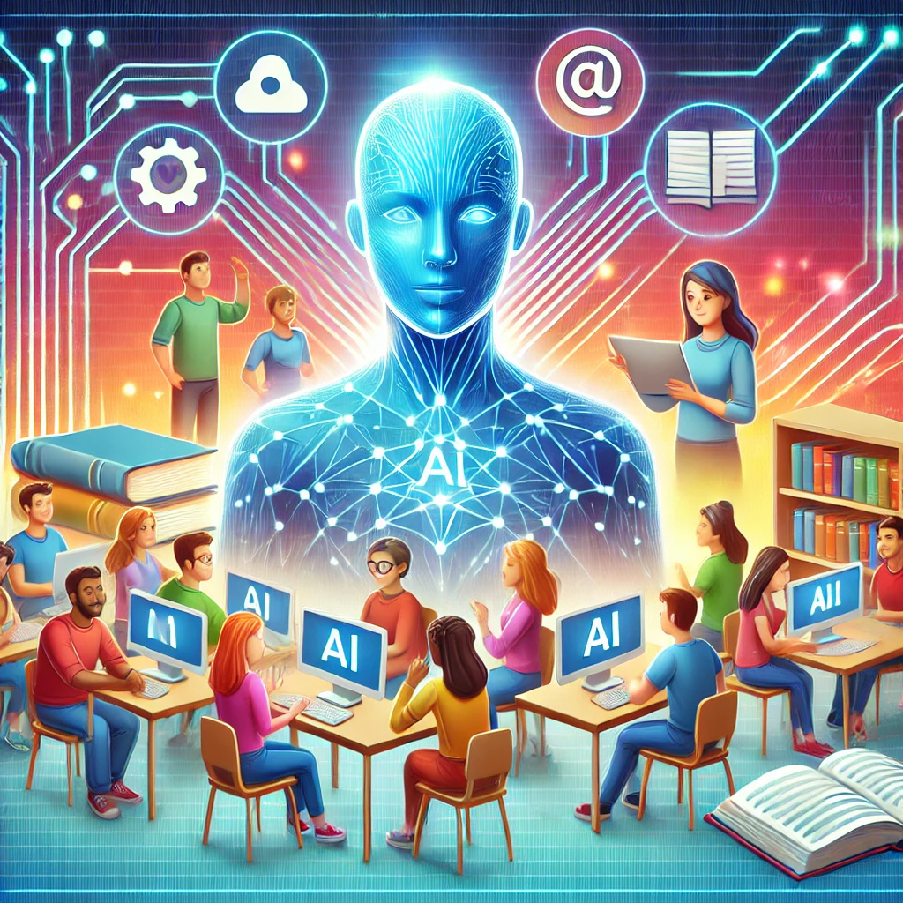

# Personalized-Learning-Tutor-with-AI-TAPI
Building AI course project

## Summary
Personalized Learning Tutor with AI (TAPI) is an artificial intelligence platform designed to provide personalized tutoring to students of all ages, adapting to their learning styles, level of knowledge, and emotional needs. It uses advanced AI to assess students' strengths and weaknesses and create individualized learning paths.
 ## Background Problem: Traditional education does not always address the individual needs of students. In large classrooms, teachers struggle to provide personalized attention, leaving some students behind and others demotivated by lack of challenge. In addition, not all students have access to personalized tutoring due to its cost.
Frequency: This problem affects millions of students in massive education systems around the world.
Personal motivation: As an educator, personalization in learning has always been a challenge. This idea addresses the need to democratize access to personalized education.
Importance: Solving this problem can increase equity in education and improve students' academic and emotional performance, better preparing them for the future.

## How is it used?
Context: The platform is designed to be used both at home and in the classroom. It can be integrated into formal education systems or used independently as a complement to learning.
Users:
Primary: Students (from primary to university level).
Secondary: Teachers and parents, who can access reports on the student's progress.
Affected people: Students with learning difficulties, parents concerned about their children's education, and teachers looking for tools to personalize teaching.

## Data sources and AI methods Data sources:
Public education databases (e.g., Open Educational Resources).
Student academic performance history (if available).
Online assessments designed to map strengths and weaknesses.
Data on learning styles and interaction preferences collected through short surveys.
AI Techniques:
Natural Language Processing (NLP): To understand questions and respond to students in natural language.
Supervised and Unsupervised Learning: To identify patterns in academic performance and suggest personalized learning materials.
Recommendation Models: To offer educational resources and exercises tailored to each student.
Emotion analysis: To identify frustration, interest or demotivation in the student and adapt the interaction accordingly.

## Challenges
Data availability: Not all students have digitized educational history.
Cultural limitations: Learning strategies can vary depending on the cultural and linguistic context, which requires adaptation.
Human interaction: AI cannot completely replace the empathy and understanding that a human teacher can provide.
Data privacy: Protecting students' personal and educational information is critical.

## What next?
Expanding reach: Include more languages and adapt materials for different education systems.
Emotional integration: Improving the system's ability to detect emotions and offer personalized motivational support.
Collaboration with institutions: Partner with schools and universities to integrate Personalized Learning Tutor with AI (TAPI) as part of the official curriculum.
Gamification: Introduce game elements to increase student motivation.
Continuous evaluation: Implement systems that collect data on the project's impact on academic and emotional outcomes.

## Acknowledgments
This project is inspired by platforms such as Khan Academy, Duolingo and ChatGPT, which have shown how technology can transform education. The educational data used will come from open resources and collaborators in the educational field. We thank the teachers, students, and developers who have shared their expertise to inspire this solution.

